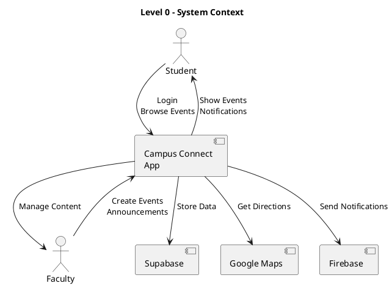
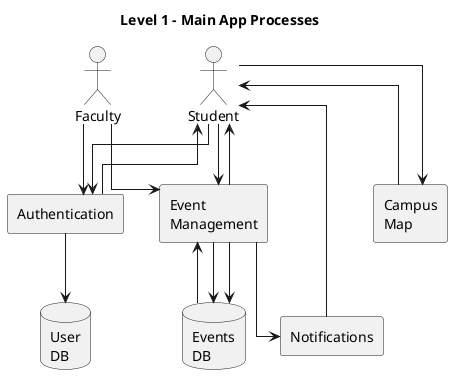
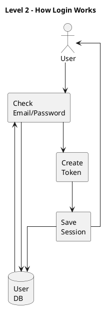
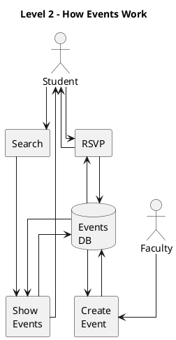

# Campus Connect Mobile App - Data Flow Diagrams

## Level 0: Context Diagram



**Description:** This shows the Campus Connect App at the center. Students and Faculty use the app. The app connects to three external services: Supabase (database), Google Maps (navigation), and Firebase (notifications). Students browse and RSVP; Faculty create content.

---

## Level 1: Main Processes



**Description:** The app has four main processes: Authentication (login), Event Management (create/browse events), Campus Map (navigation), and Notifications (alerts). Users login through Authentication. Students browse events; Faculty create events. The Map provides directions. Notifications alert users about new events.

---

## Level 2: Authentication Detail



**Description:** When a user logs in, the system first checks their email and password against the User DB. If valid, it creates an authentication token, saves the session, and returns success to the user. This keeps users logged in between app uses.

---

## Level 2: Event Management Detail



**Description:** Event Management has four parts: Show (display events), Create (add new events), RSVP (register for events), and Search (find events). Students search and RSVP. Faculty create events. All data is stored in the Events DB.

---

## Symbol Legend

| Symbol | What it means |
|--------|---------------|
| 👤 Actor | A person using the app (Student or Faculty) |
| □ Rectangle | A process or action the app performs |
| 🗄️ Database | Where data is stored |
| ☁️ Cloud | External service (Google Maps, Firebase) |
| → Arrow | Data moving from one place to another |

---

## Key Points

### What the app does:
1. **Students** can browse events, RSVP, search for faculty, and get campus directions
2. **Faculty** can create events and send announcements
3. All data is stored in **Supabase** (a cloud database)
4. **Google Maps** provides navigation
5. **Firebase** sends push notifications

### How it's organized:
- **Level 0**: Big picture - who uses the app and what services it connects to
- **Level 1**: Main features - authentication, events, map, notifications
- **Level 2**: Details - how login works and how events are managed

---

## Assumptions Made

- Two user types: Students (view content) and Faculty (create content)
- Supabase handles all data storage and user authentication
- Firebase FCM sends all push notifications
- Google Maps API handles all navigation and directions
- Events don't have seat limits (RSVP is just showing interest)
- App requires internet connection to work

---

## Questions to Improve These Diagrams

1. **Do events have capacity limits?** Can events fill up, or can unlimited students RSVP?
2. **Is there real-time sync?** Do event updates appear instantly, or only when users refresh?
3. **What works offline?** Can students view previously loaded events without internet?

---

## How to View These Diagrams

### Online (Easiest):
1. Go to http://www.plantuml.com/plantuml/uml/
2. Copy any diagram code (between ```plantuml and ```)
3. Paste and click "Submit" to see the visual diagram

### In VS Code:
1. Install "PlantUML" extension
2. Open this file
3. Click "Preview" button or press `Alt+D`

### Purpose:
- **For reviewers**: Understand the app quickly without reading code
- **For developers**: See how data flows between components
- **For new team members**: Learn the system architecture
- **For documentation**: Keep track of system design

