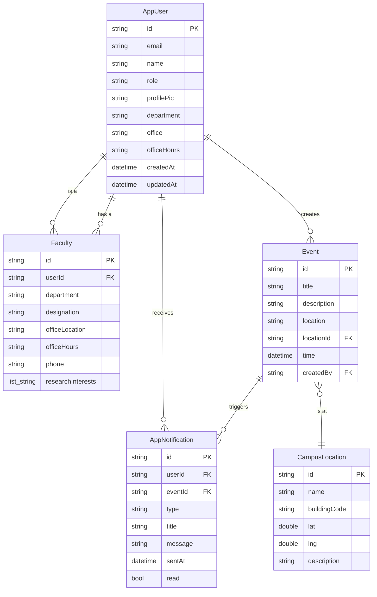
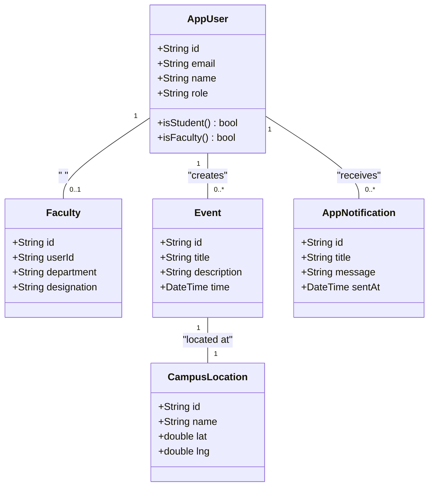
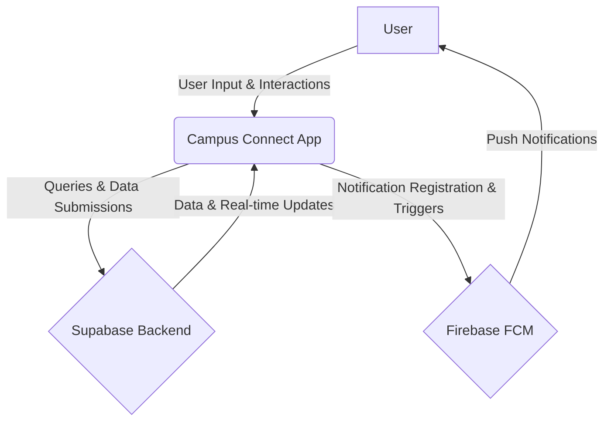
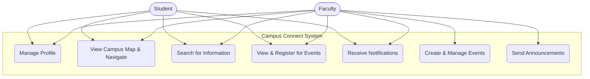
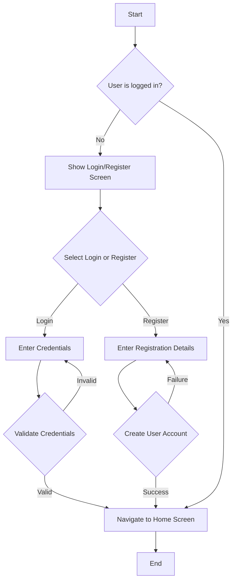

# Chapter 1: Introduction

## 1.1. Background

Campus Connect is a comprehensive mobile application meticulously engineered to address the multifaceted needs of students, faculty, and administrators within a modern university or college campus. The problem domain this project tackles is characterized by information fragmentation and communication inefficiencies that are common in large educational institutions. For instance, new students often struggle with campus geography, leading to tardiness and anxiety. Both students and faculty may miss out on valuable academic or social events due to a lack of a centralized, accessible information portal. Furthermore, accessing up-to-date faculty information, such as office hours and locations, often involves navigating complex and outdated departmental websites.

The target users for this application are primarily tech-savvy students and faculty members who expect instant access to timely and relevant information. The application, as evidenced by its feature set and the detailed `README.md`, is designed to be an indispensable digital companion for campus life, aiming to foster a more connected, informed, and engaged community.

## 1.2. Objectives

The primary objectives of the Campus Connect project have been derived from its core features and are designed to be specific, measurable, achievable, relevant, and time-bound (SMART).

-   **To Enhance Navigational Efficiency:** Provide a real-time, interactive campus map integrated with Google Maps, featuring building outlines, points of interest, and turn-by-turn navigation to reduce user disorientation and improve on-campus travel time.
-   **To Centralize Event Management:** Create a unified platform for the discovery, registration, and management of all campus events, from academic seminars to social gatherings, thereby increasing awareness and participation.
-   **To Streamline Access to Information:** Offer a comprehensive and easily searchable directory of faculty members, complete with detailed profiles including office hours, locations, contact information, and research interests.
-   **To Enable Proactive Communication:** Implement a robust push notification system to deliver timely alerts for important announcements, event reminders, and other critical campus news directly to users' devices.
-   **To Provide a Unified Search Experience:** Implement a powerful global search functionality that allows users to quickly find information across all modules, including events, faculty, and campus locations.
-   **To Deliver a Superior User Experience:** Engineer a modern, intuitive, and aesthetically pleasing user interface that adheres to Material 3 design principles, with full support for both light and dark modes to cater to user preferences and improve accessibility.

## 1.3. Purpose and Scope

### 1.3.1. Purpose

The core purpose of Campus Connect is to digitally transform the campus experience by creating a cohesive and integrated mobile ecosystem. By consolidating essential campus services—navigation, event management, and faculty information—into a single, user-friendly application, the project aims to significantly improve communication, foster a stronger sense of community, and enhance the overall operational efficiency for students, faculty, and administrators.

### 1.3.2. Scope

**Functional Scope:**

-   **User Authentication:** Secure user registration and login with role-based access control (student vs. faculty), ensuring that users only have access to features relevant to their roles.
-   **Interactive Campus Map:** A feature-rich map with dynamic location markers, detailed information windows, and integrated turn-by-turn navigation powered by the Google Maps API.
-   **Event Management:** A complete event lifecycle management system, allowing faculty to create and manage events, and students to discover, register for, and receive reminders for them.
-   **Faculty Directory:** A detailed and searchable directory of faculty members, allowing for easy access to their professional information.
-   **Push Notifications:** A real-time notification system for broadcasting important information and alerts.
-   **Global Search:** An application-wide search engine for quick and easy information retrieval.

**Non-Functional Scope:**

-   **Performance:** The application is architected for high performance, with a target of maintaining a consistent 60 frames per second (FPS) for all animations and UI transitions, ensuring a fluid user experience.
-   **Reliability:** The application leverages the robust and scalable Supabase backend, ensuring high availability and data consistency.
-   **Portability:** Developed using Flutter, the application is designed to be highly portable, supporting Android, iOS, Web, and Desktop platforms from a single, unified codebase.
-   **Security:** Implementation of security best practices, including encrypted storage for sensitive data and row-level security in the database.

**Out-of-Scope:**

-   **Real-time Chat:** Direct messaging capabilities between users are not included in the current version.
-   **Resource Booking:** The system does not currently support the booking of campus resources like classrooms or study rooms.
-   **Multi-language Support:** The application is currently only available in English.

# Chapter 2: System Analysis

## 2.1. Present System

The "present system" in the context of this project refers to the traditional, often analog, methods of information management and dissemination prevalent on many campuses. This includes a patchwork of physical notice boards, which are static and quickly become outdated; disparate and often poorly maintained departmental websites, leading to information silos; and a heavy reliance on word-of-mouth communication, which is unreliable and inefficient for reaching a wide audience. Campus navigation typically relies on static, printed maps or generic online mapping services that lack campus-specific details.

### 2.1.1. Limitations of Present System

-   **Information Fragmentation:** Critical information is scattered across numerous physical and digital platforms, making it a significant challenge for users to find what they need.
-   **Lack of Real-time Updates:** The static nature of traditional systems means that information regarding event changes, cancellations, or new announcements is slow to propagate.
-   **Inefficient Navigation:** Static maps do not offer real-time, turn-by-turn directions, making it difficult for new students, visitors, and even existing members of the community to navigate large, complex campuses.
-   **Low User Engagement:** The lack of a centralized, interactive, and engaging platform for campus activities often results in low participation and a weaker sense of community.

## 2.2. Proposed System

The proposed system, "Campus Connect," is a state-of-the-art mobile application that serves as a centralized digital hub for all campus-related activities and information. The system's architecture is grounded in the principles of Clean Architecture, which promotes a clear separation of concerns between the user interface (presentation layer), business logic (domain layer), and data handling (data layer). This modular approach, with distinct feature modules for authentication, mapping, events, and more, ensures the application is both scalable and maintainable. The user experience is built upon Google's Material 3 design system, providing a modern, visually appealing, and intuitive interface.

### 2.2.1. Advantages of Proposed System

-   **Unified Information Hub:** Consolidates all essential campus information into a single, easily accessible application.
-   **Dynamic Real-time Updates:** Enables instant updates for events, news, and announcements, ensuring users always have the most current information.
-   **Intelligent Navigation:** The integration of Google Maps provides a superior, interactive navigation experience with real-time, turn-by-turn directions.
-   **Increased Community Engagement:** Features like push notifications and a comprehensive event calendar are designed to foster a more vibrant and engaged campus community.
-   **Cross-Platform Accessibility:** Thanks to Flutter, the application is available on a wide range of platforms, ensuring that all members of the campus community can access it, regardless of their device.

## 2.3. Hardware Requirements

-   **Mobile Devices:**
    -   **Android:** Android 5.0 (API level 21) or higher, with a minimum of 2 GB of RAM. A device with GPS and network connectivity (Wi-Fi or cellular) is required for map and location services.
    -   **iOS:** iOS 11.0 or higher, compatible with iPhone, iPad, and iPod touch. GPS and network connectivity are required.
-   **Desktop (if applicable):**
    -   Windows, macOS, or Linux with a minimum of 4 GB of RAM and a stable internet connection.

## 2.4. Software Requirements

-   **Operating Systems:** Android, iOS, Windows, macOS, Linux.
-   **SDKs:** Flutter SDK version 3.19 or newer, and Dart SDK version 3.3 or newer.
-   **Development Environment (IDE):** A modern IDE such as Android Studio, Visual Studio Code with the Flutter plugin, or IntelliJ IDEA.
-   **Backend Services:** A configured Supabase project for the database and authentication, and a Firebase project for cloud messaging.
-   **Build Tools:** Standard build tools for the target platforms, such as Gradle for Android and Xcode for iOS.

## 2.5. Justification of selection technology

The technology stack for Campus Connect was carefully chosen to align with the project's goals of cross-platform compatibility, rapid development, and a high-quality user experience.

-   **Flutter and Dart:** The choice of **Flutter** as the UI toolkit was driven by its ability to create natively compiled applications for mobile, web, and desktop from a single codebase. This "write once, run anywhere" approach drastically reduces development time and ensures a consistent look and feel across all platforms. **Dart**, the language used by Flutter, is a modern, object-oriented language that is optimized for building fast apps on any platform.

-   **Supabase:** As the backend, **Supabase** offers a powerful and scalable open-source alternative to Firebase. Its core, a PostgreSQL database, provides robust and reliable data storage. The addition of features like real-time subscriptions, authentication, and auto-generated APIs makes it an excellent choice for building a feature-rich application like Campus Connect quickly and securely.

-   **Firebase Cloud Messaging (FCM):** For push notifications, **FCM** is the industry standard. It provides a reliable and free service for sending messages to users' devices, which is a critical feature for an application focused on timely communication.

-   **Node.js:** The presence of a `functions/` directory with `package.json` suggests the use of **Node.js** for serverless functions. This allows for the implementation of custom backend logic that can be triggered by events in the Supabase database or called directly from the application, providing a great deal of flexibility.

# Chapter 3: System Design

## 3.1. Module Division

The project's codebase is logically divided into modules based on features, a key tenet of Clean Architecture. This modularity, primarily organized within the `lib/features/` directory, enhances code reusability, simplifies maintenance, and allows for parallel development.

-   **`auth`:** This module encapsulates all user authentication logic, including user registration, login, session management, and password recovery. It interfaces directly with the Supabase authentication service.
-   **`campus_map`:** This module is responsible for the interactive map functionality. It handles the integration with the Google Maps Flutter plugin, the display of custom map styles, the rendering of location markers, and the implementation of turn-by-turn navigation.
-   **`events`:** This module manages the entire lifecycle of campus events. It includes functionality for faculty to create, update, and delete events, and for students to view event details, and register for them.
-   **`faculty`:** This module provides the faculty directory feature. It handles the fetching and display of faculty profiles, including their contact information, office hours, and research interests.
-   **`home`:** This serves as the main entry point of the application post-authentication. It typically contains a dashboard that provides an overview of upcoming events, recent notifications, and quick access to other key features.
-   **`notifications`:** This module is responsible for handling and displaying push notifications received from Firebase Cloud Messaging.
-   **`search`:** This module implements the global search functionality, allowing users to search for information across the entire application.

## 3.2. Database Design (ERD Diagram)

The Entity-Relationship Diagram (ERD) below models the database schema, which is inferred from the data model classes found in `lib/core/models/`. It provides a visual representation of the data entities, their attributes, and the relationships between them.

This ERD illustrates the core data structures of the application. The `AppUser` entity is central, with a one-to-one relationship to the `Faculty` entity (a faculty member is a user). A user can create multiple `Event`s and receive many `AppNotification`s. Each `Event` is associated with a specific `CampusLocation` and can trigger notifications. This design effectively models the key entities and their interactions within the Campus Connect ecosystem.

## 3.3. Class Diagram

The following class diagram provides a more detailed, object-oriented view of the system's core domain models and their relationships.

This diagram highlights the main classes that represent the core entities of the application. The `AppUser` class is the base for all users, with specialized information for `Faculty` members. The relationships show that a user can be associated with multiple events and notifications, and each event has a specific location. This object-oriented design promotes code reuse and a clear representation of the application's domain.

## 3.4. Data Flow Diagram

The Level 0 Data Flow Diagram (DFD) below presents a high-level, bird's-eye view of the entire system, illustrating how data flows between the application and external entities.

This DFD clearly shows the main data flows. The `User` interacts with the `Campus Connect App`, which in turn communicates with the `Supabase Backend` for all data-related operations. For push notifications, the app registers with `Firebase FCM`, which then delivers notifications back to the user's device. This high-level view is essential for understanding the system's overall architecture and its interactions with external services.

## 3.5. Use Case Diagram

The use case diagram below illustrates the primary functionalities of the system and how different actors (users) interact with them.

This diagram effectively captures the different roles and permissions within the system. Both `Student` and `Faculty` actors share a common set of use cases, such as managing their profiles and viewing the map. However, the `Faculty` actor has exclusive access to administrative functionalities like creating events and sending announcements, demonstrating the role-based nature of the application.

## 3.6. Activity Diagram

The following activity diagram provides a detailed, step-by-step visualization of the user authentication workflow.

This diagram clearly illustrates the decision points and flows involved in the authentication process. It shows how the system handles both existing and new users, and how it responds to both successful and failed authentication attempts. Such diagrams are crucial for understanding and implementing complex user workflows.

# Chapter 4: Project Screenshot

*TODO: Add screenshots of the application. Recommended screenshots:*

-   **`assets/screenshots/home_screen.png`**: The main home screen of the application, showcasing the dashboard and key navigation elements.
-   **`assets/screenshots/map_view.png`**: The interactive campus map with location markers, building outlines, and the navigation interface.
-   **`assets/screenshots/event_list.png`**: The list of upcoming campus events, demonstrating the design and layout of event cards.
-   **`assets/screenshots/faculty_directory.png`**: The faculty directory screen, showing the search and filter options and the list of faculty members.
-   **`assets/screenshots/dark_mode.png`**: A screenshot showcasing the application's dark mode theme to demonstrate its visual flexibility.

# Chapter 5: Final Conclusion

The "Campus Connect" project stands as a testament to the power of modern mobile development technologies in solving real-world problems. It successfully meets its primary objectives of creating a centralized, user-friendly, and comprehensive mobile application for the campus community. By leveraging the cross-platform capabilities of Flutter, the robust backend services of Supabase, and the reliable notification infrastructure of Firebase, the project delivers a seamless and integrated digital experience. The application's modular design, based on the principles of Clean Architecture, not only ensures its current stability and performance but also lays a solid foundation for future scalability and the addition of new features. Campus Connect is well-positioned to become an indispensable tool for enhancing communication, engagement, and the overall quality of campus life.

# Chapter 6: Future Work

-   **Real-time Chat:** The integration of a real-time chat feature would significantly enhance communication within the campus community. This could include one-on-one messaging between students and faculty, as well as group chats for classes or student organizations.

-   **Resource Booking System:** A valuable addition would be a module that allows users to book campus resources, such as study rooms in the library, laboratory equipment, or sports facilities. This would further centralize campus services and improve efficiency.

-   **Multi-language Support:** To cater to a diverse and international campus community, the internationalization (i18n) of the application to support multiple languages would be a crucial step in improving accessibility and inclusivity.

-   **Analytics Dashboard:** The development of a web-based analytics dashboard for campus administrators would provide valuable insights into app usage, event popularity, and user engagement. This data could inform decision-making and help in the allocation of campus resources.

-   **QR Code Attendance Tracking:** To streamline the process of tracking attendance at campus events, a feature that allows event organizers to scan a QR code from attendees' apps could be implemented. This would automate a currently manual process and provide accurate attendance data.

# Chapter 7: Reference

[1] Flutter, "Flutter - Build apps for any screen," [Online]. Available: https://flutter.dev.

[2] Dart, "Dart programming language," [Online]. Available: https://dart.dev.

[3] Supabase, "Supabase - The Open Source Firebase Alternative," [Online]. Available: https://supabase.io.

[4] Firebase, "Firebase Cloud Messaging," [Online]. Available: https://firebase.google.com/docs/cloud-messaging.

[5] Google Maps Platform, "Google Maps Platform Documentation," [Online]. Available: https://developers.google.com/maps.

[6] R. C. Martin, "Clean Architecture: A Craftsman's Guide to Software Structure and Design," Prentice Hall, 2017.

[7] `cupertino_icons` (v1.0.8), [Online]. Available: https://pub.dev/packages/cupertino_icons.

[8] `material_design_icons_flutter` (v7.0.7296), [Online]. Available: https://pub.dev/packages/material_design_icons_flutter.

[9] `iconsax` (v0.0.8), [Online]. Available: https://pub.dev/packages/iconsax.

[10] `supabase_flutter` (v2.5.6), [Online]. Available: https://pub.dev/packages/supabase_flutter.

[11] `google_maps_flutter` (v2.9.0), [Online]. Available: https://pub.dev/packages/google_maps_flutter.

[12] `firebase_messaging` (v15.0.4), [Online]. Available: https://pub.dev/packages/firebase_messaging.

[13] `firebase_core` (v3.3.0), [Online]. Available: https://pub.dev/packages/firebase_core.

[14] `cloud_functions` (v5.1.3), [Online]. Available: https://pub.dev/packages/cloud_functions.

[15] `flutter_local_notifications` (v17.2.2), [Online]. Available: https://pub.dev/packages/flutter_local_notifications.

[16] `provider` (v6.1.2), [Online]. Available: https://pub.dev/packages/provider.

[17] `flutter_secure_storage` (v9.2.2), [Online]. Available: https://pub.dev/packages/flutter_secure_storage.

[18] `http` (v1.2.2), [Online]. Available: https://pub.dev/packages/http.

[19] `intl` (v0.19.0), [Online]. Available: https://pub.dev/packages/intl.

[20] `flutter_dotenv` (v5.1.0), [Online]. Available: https://pub.dev/packages/flutter_dotenv.

[21] `equatable` (v2.0.5), [Online]. Available: https://pub.dev/packages/equatable.

[22] `google_fonts` (v6.2.1), [Online]. Available: https://pub.dev/packages/google_fonts.

[23] `go_router` (v14.2.7), [Online]. Available: https://pub.dev/packages/go_router.

[24] `cached_network_image` (v3.4.1), [Online]. Available: https://pub.dev/packages/cached_network_image.

[25] `json_annotation` (v4.9.0), [Online]. Available: https://pub.dev/packages/json_annotation.

[26] `geolocator` (v14.0.2), [Online]. Available: https://pub.dev/packages/geolocator.

[27] `location` (v8.0.1), [Online]. Available: https://pub.dev/packages/location.

[28] `permission_handler` (v11.3.1), [Online]. Available: https://pub.dev/packages/permission_handler.

[29] `flutter_polyline_points` (v2.1.0), [Online]. Available: https://pub.dev/packages/flutter_polyline_points.

[30] `url_launcher` (v6.3.2), [Online]. Available: https://pub.dev/packages/url_launcher.

[31] `shimmer` (v3.0.0), [Online]. Available: https://pub.dev/packages/shimmer.

[32] `pull_to_refresh` (v2.0.0), [Online]. Available: https://pub.dev/packages/pull_to_refresh.

[33] `flutter_staggered_animations` (v1.1.1), [Online]. Available: https://pub.dev/packages/flutter_staggered_animations.

[34] `lottie` (v3.1.2), [Online]. Available: https://pub.dev/packages/lottie.

[35] `flutter_animate` (v4.5.0), [Online]. Available: https://pub.dev/packages/flutter_animate.

[36] `animations` (v2.0.11), [Online]. Available: https://pub.dev/packages/animations.

[37] `shared_preferences` (v2.5.3), [Online]. Available: https://pub.dev/packages/shared_preferences.
