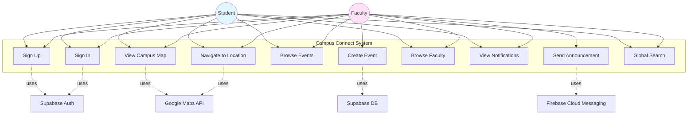
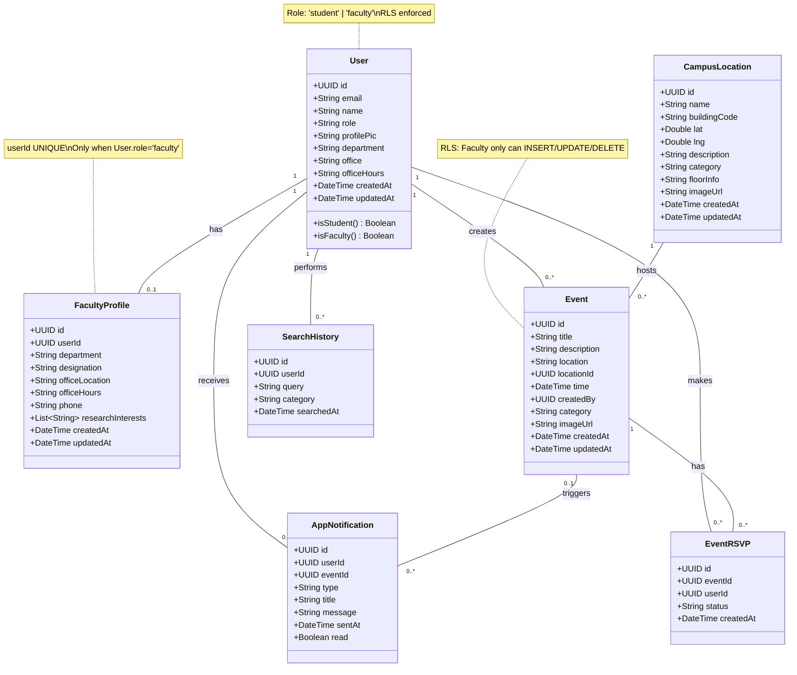
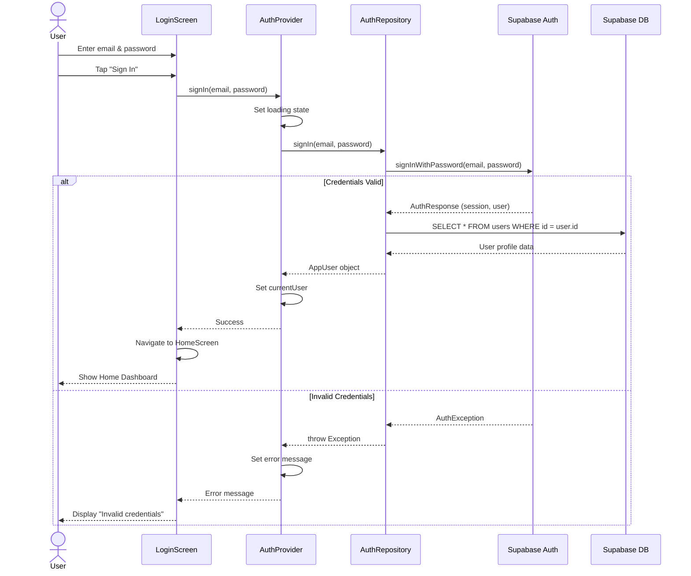
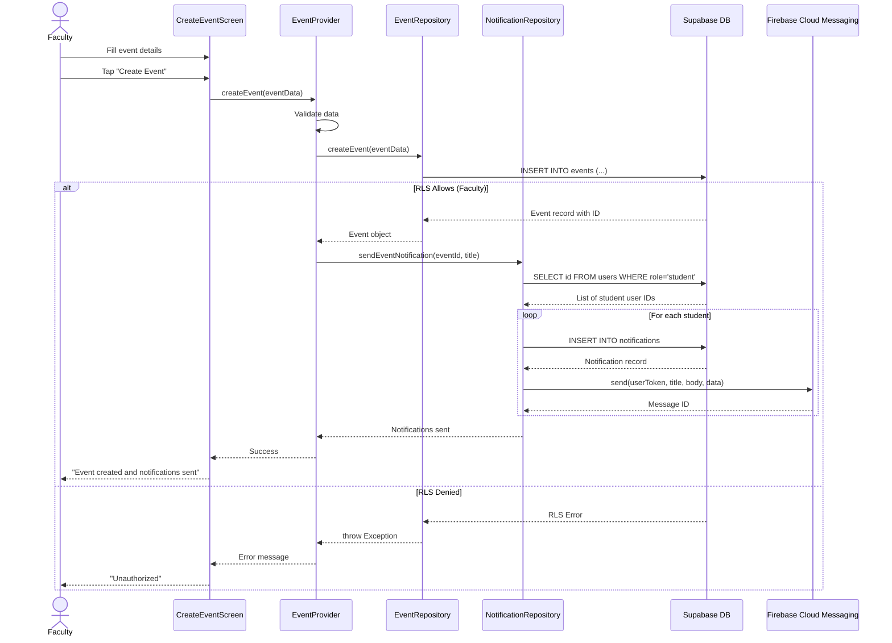
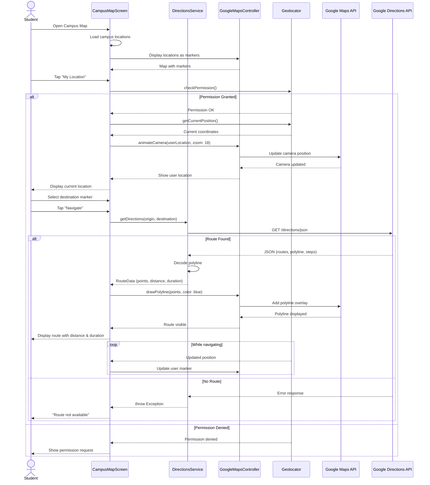
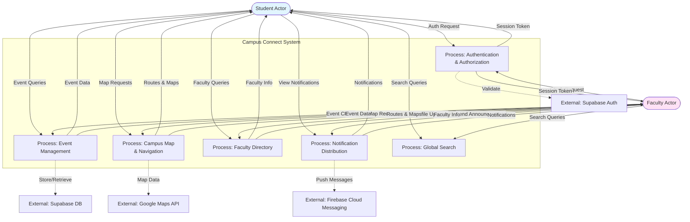
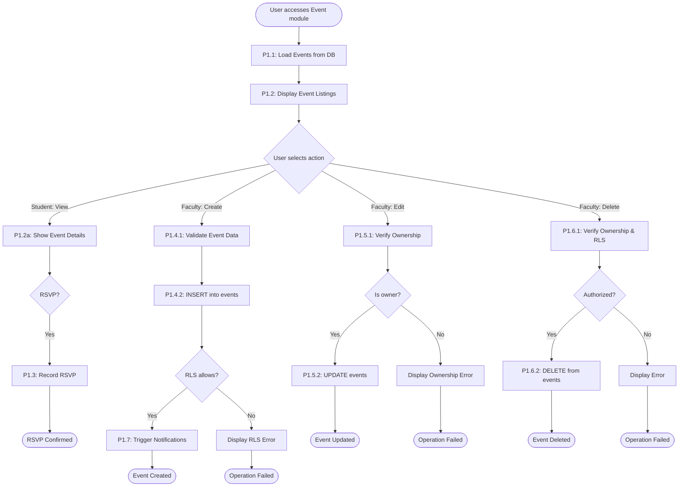
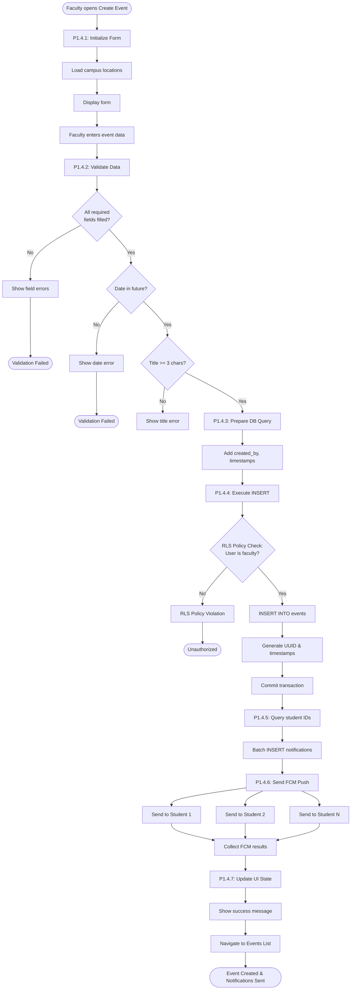

# Campus Connect - UML Architecture Documentation

## Table of Contents
1. [Conformance & Viewpoints](#conformance--viewpoints)
2. [Use Case Diagram](#use-case-diagram)
3. [Logical Data Model](#logical-data-model)
4. [Sequence Diagrams](#sequence-diagrams)
   - [Sign-In Flow](#sign-in-flow)
   - [Event Creation & Notifications](#event-creation--notifications)
   - [Map Navigation](#map-navigation)
5. [Activity Diagrams (Process Models)](#activity-diagrams-process-models)
   - [Level 0: Context Diagram](#level-0-context-diagram)
   - [Level 1: Event Management](#level-1-event-management)
   - [Level 2: Create Event](#level-2-create-event)

---

## Conformance & Viewpoints

### Standards Compliance

This documentation conforms to the following international standards:

- **ISO/IEC 19505-1:2012 / ISO/IEC 19505-2:2012** - Unified Modeling Language (UML) 2.5 specification
- **ISO/IEC/IEEE 42010:2011** - Systems and software engineering — Architecture description

### Architecture Viewpoints

This documentation presents the Campus Connect system architecture through the following standardized viewpoints:

#### 1. **Use Case Viewpoint** (Functional Requirements)
Captures the functional requirements and interactions between actors (Student, Faculty) and the system, including external systems (Supabase, Google Maps, Firebase Cloud Messaging). Defines system boundaries and user goals.

#### 2. **Logical Data Viewpoint** (Information Architecture)
Represents the logical data model using UML Class Diagram notation, showing entities, attributes, relationships, and multiplicities. This supersedes traditional Entity-Relationship Diagrams (ERDs) for UML compliance while maintaining the same semantic richness.

#### 3. **Behavioral Viewpoint** (Dynamic Behavior)
Captures dynamic system behavior through UML Sequence Diagrams, showing time-ordered message exchanges between components, actors, and external systems for critical use cases.

#### 4. **Process Viewpoint** (Data and Control Flows)
Uses UML Activity Diagrams to represent process flows at multiple abstraction levels (Level 0, 1, 2). These diagrams provide DFD-equivalent semantics using UML-standard notation, showing data transformations, decision points, parallel processing, and swimlanes for responsibility allocation.

### Repository Analysis & Assumptions

**Source Code Analysis:**
- Primary codebase: `/lib` directory with feature-based architecture
- Core models: User, Event, Faculty, CampusLocation, AppNotification
- State management: Provider pattern (ChangeNotifier)
- Backend: Supabase (PostgreSQL) with Row Level Security (RLS)
- External integrations: Google Maps API, Google Directions API, Firebase Cloud Messaging

**Database Schema:** (from `SUPABASE_SETUP.md` and `database_phase6_setup.sql`)
- Tables: users, faculty, events, campus_locations, notifications, search_history, event_rsvp (implied)
- Role-based access: Student ('student') and Faculty ('faculty') roles enforced via RLS policies
- Relationships validated against repository code and database constraints

**Key Assumptions:**
1. Event RSVP functionality exists (implied from progress documentation)
2. Faculty profile is optional and only exists when User.role = 'faculty'
3. Notifications can be broadcast (userId NULL) or user-specific
4. All geographic operations use WGS84 coordinate system (standard for Google Maps)
5. Authentication flow uses Supabase Auth with JWT tokens
6. Push notifications are asynchronous and non-blocking

### Diagram Authoritativeness

**Canonical Format:** PlantUML (`.puml` files)
All `.puml` files are the authoritative, version-controlled source of truth for the architecture diagrams. They can be rendered using any PlantUML-compatible tool.

**Preview Format:** Mermaid (in this Markdown)
Mermaid diagrams below are provided for GitHub preview convenience only. In cases of discrepancy, the PlantUML `.puml` files take precedence.

---

## Use Case Diagram

**File:** [`use_case.puml`](./use_case.puml)

**Scope:** Captures all functional requirements of the Campus Connect system, showing interactions between Student and Faculty actors with system use cases, including dependencies on external systems (Supabase Auth/DB, Google Maps API, Firebase Cloud Messaging).

**Key Elements:**
- **Actors:** Student (primary), Faculty (extends Student capabilities with additional permissions)
- **System Boundary:** Campus Connect application
- **External Systems:** Supabase Auth, Supabase DB, Google Maps API, Firebase Cloud Messaging
- **Use Cases:** 30+ use cases covering authentication, campus map, events, faculty directory, notifications, and search
- **Relationships:** Association (actor-to-use-case), extension (<<extends>>), inclusion (<<uses>>)

### Mermaid Preview (Use Case)



---

## Logical Data Model

**File:** [`logical_data_model.puml`](./logical_data_model.puml)

**Scope:** Represents the logical data structure of the Campus Connect system using UML Class Diagram notation. This diagram supersedes traditional ERD format to maintain UML compliance while capturing all entity relationships, attributes, and constraints.

**Key Elements:**
- **Entities:** User, FacultyProfile, CampusLocation, Event, AppNotification, SearchHistory, EventRSVP
- **Attributes:** Typed attributes with multiplicity notation (e.g., `[0..1]` for optional, `[0..*]` for zero-to-many)
- **Relationships:** Associations with proper multiplicities following database schema
- **Constraints:** Role constraints (CHECK), uniqueness, and RLS policies documented via notes

**Multiplicities:**
- User 1 ── 0..1 FacultyProfile (one-to-zero-or-one)
- User 1 ── 0..* Event (one-to-many, via createdBy)
- CampusLocation 1 ── 0..* Event (one-to-many, via locationId)
- User 1 ── 0..* AppNotification (one-to-many, via userId)
- Event 0..1 ── 0..* AppNotification (zero-or-one-to-many, via eventId)
- User 1 ── 0..* SearchHistory (one-to-many)
- User 1 ── 0..* EventRSVP (one-to-many)
- Event 1 ── 0..* EventRSVP (one-to-many)

### Mermaid Preview (Class Diagram)



---

## Sequence Diagrams

### Sign-In Flow

**File:** [`sequence_sign_in.puml`](./sequence_sign_in.puml)

**Scope:** Depicts the authentication flow when a user (Student or Faculty) signs into the Campus Connect application. Shows interaction between UI layer, state management (AuthProvider), data layer (AuthRepository), services, and external Supabase Auth/DB systems.

**Key Participants:**
- User (actor)
- LoginScreen (UI)
- AuthProvider (state management)
- AuthRepository (data layer)
- SupabaseService (service)
- Supabase Auth (external)
- Supabase DB (external)

**Flow Scenarios:**
1. **Success:** Valid credentials → session created → user profile retrieved → navigate to home
2. **Invalid credentials:** Authentication error → display error message
3. **Network error:** Network exception → display error message

**Key Observations:**
- Password validation handled by Supabase Auth
- JWT token generation automatic
- Row Level Security (RLS) ensures user can only access own profile
- AuthProvider uses ChangeNotifier pattern for reactive UI updates

#### Mermaid Preview (Sign-In Sequence)



---

### Event Creation & Notifications

**File:** [`sequence_event_create_notifications.puml`](./sequence_event_create_notifications.puml)

**Scope:** Demonstrates the complete workflow when a Faculty member creates a new event, including database insertion with RLS policy check and automated notification distribution to all students via both database records and Firebase Cloud Messaging push notifications.

**Key Participants:**
- Faculty (actor)
- CreateEventScreen (UI)
- EventProvider (state management)
- EventRepository (data layer)
- NotificationRepository (data layer)
- Supabase DB (external)
- Firebase Cloud Messaging (external)

**Flow Scenarios:**
1. **Success:** Faculty creates event → RLS allows → event inserted → notifications created → FCM messages sent → students notified
2. **RLS policy violation:** Non-faculty user attempts creation → database rejects via RLS policy
3. **Database error:** Connection or constraint violation → error displayed

**Key Observations:**
- Row Level Security enforces faculty-only event creation at database level
- Notification creation is atomic: DB record + FCM push
- FCM failures don't prevent event creation (notifications still in DB)
- Location selection integrated with CampusLocation entity
- Batch notification creation for performance

#### Mermaid Preview (Event Creation Sequence)



---

### Map Navigation

**File:** [`sequence_map_navigation.puml`](./sequence_map_navigation.puml)

**Scope:** Illustrates the complete navigation workflow when a Student uses the campus map to navigate from their current location to a selected campus location. Includes location permission handling, real-time GPS tracking, route calculation via Google Directions API, and route visualization on Google Maps.

**Key Participants:**
- Student (actor)
- CampusMapScreen (UI)
- LocationRepository (data layer)
- DirectionsService (service)
- GoogleMapsController (widget)
- Geolocator (plugin)
- Google Maps API (external)
- Google Directions API (external)

**Flow Scenarios:**
1. **Success:** Location permission granted → current position retrieved → destination selected → route calculated → polyline displayed → real-time tracking
2. **Permission denied:** User denies location access → request permission → retry or show error
3. **No route found:** Directions API cannot calculate route → display error
4. **Network error:** API unreachable → display error

**Key Observations:**
- Location permissions handled gracefully with user prompts
- Real-time position updates during navigation
- Walking route optimization via Google Directions API
- Polyline decoding for route visualization
- Camera animations for smooth UX
- Clear route functionality for cleanup

#### Mermaid Preview (Map Navigation Sequence)



---

## Activity Diagrams (Process Models)

Activity diagrams are used to represent data and control flows at multiple abstraction levels, providing UML-standard equivalents to Data Flow Diagrams (DFDs). These diagrams show processes, decision points, parallel flows, and swimlanes for responsibility allocation.

### Level 0: Context Diagram

**File:** [`activity_level0_context.puml`](./activity_level0_context.puml)

**Scope:** Highest-level view of the Campus Connect system, showing the system boundary, primary actors (Student, Faculty), major processes within the system, and external entities (Supabase Auth/DB, Google Maps API, FCM). Equivalent to a DFD Level 0 context diagram.

**Key Elements:**
- **Actors/External Entities:** Student, Faculty, Supabase Auth, Supabase DB, Google Maps API, Google Directions API, Firebase Cloud Messaging
- **System Boundary:** Campus Connect application
- **Major Processes:** Authentication & Authorization, Event Management, Campus Map & Navigation, Faculty Directory Management, Notification Distribution, Global Search
- **Data Flows:** User requests, authentication credentials, event data, map requests, notifications

**Balanced Flows:**
- Input: User credentials, search queries, event creation requests, location requests
- Output: Authenticated sessions, event listings, map routes, faculty information, notifications

#### Mermaid Preview (Level 0 Context)



---

### Level 1: Event Management

**File:** [`activity_level1_event_management.puml`](./activity_level1_event_management.puml)

**Scope:** Decomposition of the Event Management process (from Level 0) into sub-processes, showing detailed workflows for retrieving, displaying, creating, editing, and deleting events, as well as RSVP functionality. Includes decision points for role-based access control. Equivalent to DFD Level 1.

**Key Sub-Processes:**
- P1.1: Retrieve Events (query database with RLS)
- P1.2: Display Events (format and present to user)
- P1.3: RSVP to Event (student-only)
- P1.4: Create Event (faculty-only)
- P1.5: Edit Event (faculty-only, ownership check)
- P1.6: Delete Event (faculty-only, ownership check)
- P1.7: Trigger Notifications (automated)

**Data Stores:**
- D1: events table
- D2: event_rsvp table
- D3: notifications table
- D4: users table (role checks)

**Balanced Flows:**
- Input: User role, event filters, event data, RSVP requests
- Output: Event listings, RSVP confirmations, event CRUD confirmations, notification triggers

**Decision Points:**
- User role check (Student vs Faculty)
- Action type (Create vs Edit vs Delete vs RSVP)
- RLS policy validation
- Ownership verification

#### Mermaid Preview (Level 1 Event Management)



---

### Level 2: Create Event

**File:** [`activity_level2_create_event.puml`](./activity_level2_create_event.puml)

**Scope:** Detailed decomposition of the Create Event sub-process (P1.4 from Level 1), showing granular steps from form initialization through validation, database insertion with RLS checks, notification creation, and FCM push distribution. Equivalent to DFD Level 2.

**Key Sub-Sub-Processes:**
- P1.4.1: Initialize Form (load locations)
- P1.4.2: Validate Input Data (required fields, date validation, title length)
- P1.4.3: Prepare Database Query (add created_by, timestamps)
- P1.4.4: Execute RLS-Protected Insert (database transaction)
- P1.4.5: Create Notification Records (batch insert for students)
- P1.4.6: Send FCM Push Notifications (parallel distribution)
- P1.4.7: Update UI State (success/error feedback)

**Data Stores:**
- D1.1: events table
- D1.2: notifications table
- D1.3: users table
- D1.4: campus_locations table

**Balanced Flows:**
- Input: Event form data (title, description, category, location_id, time, image_url), user auth token
- Processing: Validation, RLS check, database insertion, notification creation, FCM distribution
- Output: Event record, notification records, FCM message IDs, UI success/error state

**Validation Steps:**
1. Required fields check (title, location_id, time)
2. Date/time future validation
3. Title length minimum (3 characters)
4. RLS policy evaluation (faculty role check)

**Parallel Processing:**
- FCM notifications sent in parallel to all student devices
- Database notification records created before FCM send
- FCM failures don't block event creation

#### Mermaid Preview (Level 2 Create Event)



---

## Diagram Rendering

### PlantUML Rendering (Authoritative)

To render the canonical `.puml` files, use any of the following methods:

1. **Online:** [PlantUML Web Server](http://www.plantuml.com/plantuml/uml/)
2. **VS Code:** Install "PlantUML" extension by jebbs
3. **IntelliJ IDEA:** Built-in PlantUML support
4. **CLI:** Install PlantUML JAR and run `java -jar plantuml.jar *.puml`
5. **CI/CD:** Integrate PlantUML rendering in build pipelines

### Mermaid Rendering (Preview)

Mermaid diagrams in this Markdown render automatically on GitHub. For local viewing:
1. **VS Code:** Install "Markdown Preview Mermaid Support" extension
2. **Online:** [Mermaid Live Editor](https://mermaid.live/)

---

## Repository Structure

```
docs/uml/
├── README.md (this file)
├── use_case.puml
├── logical_data_model.puml
├── sequence_sign_in.puml
├── sequence_event_create_notifications.puml
├── sequence_map_navigation.puml
├── activity_level0_context.puml
├── activity_level1_event_management.puml
└── activity_level2_create_event.puml
```

---

## Maintenance & Updates

**Last Updated:** 2025-10-15

**Maintainers:** Campus Connect Development Team

**Change Process:**
1. Modify `.puml` files (authoritative source)
2. Validate syntax using PlantUML renderer
3. Update Mermaid previews in this README for major changes
4. Update conformance notes if architecture viewpoints change
5. Commit both `.puml` files and README.md

**Review Frequency:** Update diagrams when:
- Database schema changes (update logical_data_model.puml)
- New features added (update use_case.puml)
- Process flows change (update sequence and activity diagrams)
- External system integrations change (update all affected diagrams)

---

## References

- **UML Specification:** [OMG UML 2.5.1](https://www.omg.org/spec/UML/2.5.1/)
- **ISO/IEC 19505-1:2012:** UML Infrastructure
- **ISO/IEC 19505-2:2012:** UML Superstructure
- **ISO/IEC/IEEE 42010:2011:** Architecture Description Standard
- **PlantUML Documentation:** [https://plantuml.com/](https://plantuml.com/)
- **Campus Connect Repository:** [README.md](../../README.md)
- **Supabase Setup:** [SUPABASE_SETUP.md](../../SUPABASE_SETUP.md)
- **Development Progress:** [progress.md](../../progress.md)

---

**End of UML Architecture Documentation**
