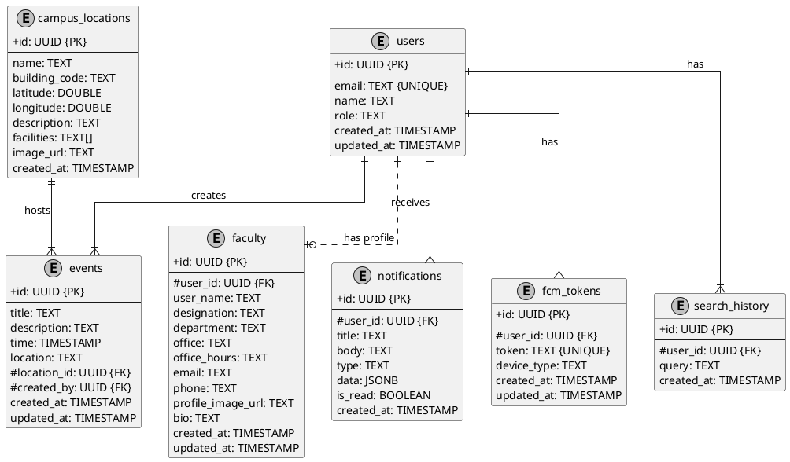

```plantuml
@startuml
' ER Diagram for Campus Connect
' This version uses standard PlantUML syntax for ER diagrams.

' skinparams for a clean and readable layout
skinparam linetype ortho
skinparam monochrome true
skinparam shadowing false
skinparam handwritten false
skinparam classAttributeIconSize 0
skinparam packageStyle rect

' Entities Definition
entity "users" {
  + id: UUID {PK}
  --
  email: TEXT {UNIQUE}
  name: TEXT
  role: TEXT
  created_at: TIMESTAMP
  updated_at: TIMESTAMP
}

entity "faculty" {
  + id: UUID {PK}
  --
  # user_id: UUID {FK}
  user_name: TEXT
  designation: TEXT
  department: TEXT
  office: TEXT
  office_hours: TEXT
  email: TEXT
  phone: TEXT
  profile_image_url: TEXT
  bio: TEXT
  created_at: TIMESTAMP
  updated_at: TIMESTAMP
}

entity "campus_locations" {
  + id: UUID {PK}
  --
  name: TEXT
  building_code: TEXT
  latitude: DOUBLE
  longitude: DOUBLE
  description: TEXT
  facilities: TEXT[]
  image_url: TEXT
  created_at: TIMESTAMP
}

entity "events" {
  + id: UUID {PK}
  --
  title: TEXT
  description: TEXT
  time: TIMESTAMP
  location: TEXT
  # location_id: UUID {FK}
  # created_by: UUID {FK}
  created_at: TIMESTAMP
  updated_at: TIMESTAMP
}

entity "notifications" {
  + id: UUID {PK}
  --
  # user_id: UUID {FK}
  title: TEXT
  body: TEXT
  type: TEXT
  data: JSONB
  is_read: BOOLEAN
  created_at: TIMESTAMP
}

entity "fcm_tokens" {
  + id: UUID {PK}
  --
  # user_id: UUID {FK}
  token: TEXT {UNIQUE}
  device_type: TEXT
  created_at: TIMESTAMP
  updated_at: TIMESTAMP
}

entity "search_history" {
  + id: UUID {PK}
  --
  # user_id: UUID {FK}
  query: TEXT
  created_at: TIMESTAMP
}

' Relationships Definition
users ||..o| faculty : "has profile"
users ||--|{ events : "creates"
users ||--|{ notifications : "receives"
users ||--|{ fcm_tokens : "has"
users ||--|{ search_history : "has"

campus_locations ||--|{ events : "hosts"

@enduml
```
