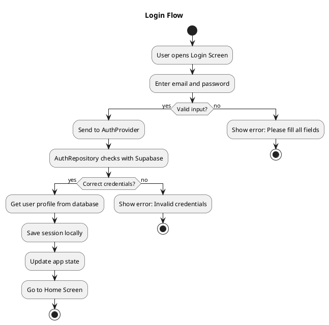
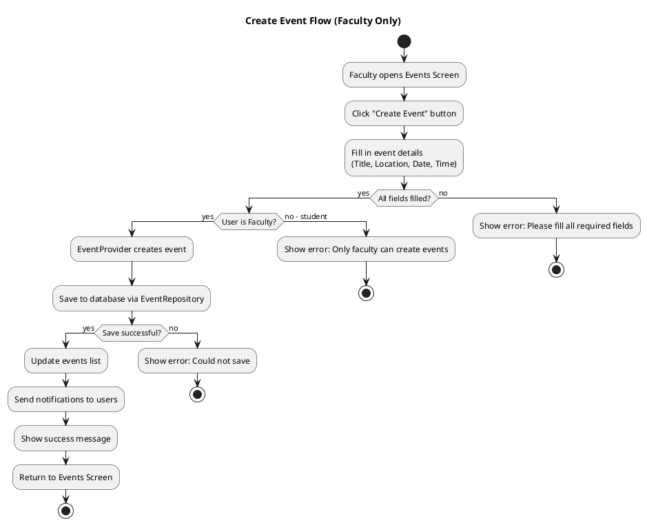

# Campus Connect - UML Diagrams

Professional UML diagrams representing the Campus Connect mobile application architecture.

---

## 1. Class Diagram

**Purpose:** Shows the main classes and their relationships in the system.

```plantuml
@startuml
title Class Diagram - Campus Connect System

' Models
class AppUser {
  - id : String
  - email : String
  - name : String
  - role : String
  - profilePic : String?
  - department : String?
  - office : String?
  - officeHours : String?
  - createdAt : DateTime?
  - updatedAt : DateTime?
  + isStudent() : bool
  + isFaculty() : bool
  + copyWith() : AppUser
  + toJson() : Map
  + fromJson() : AppUser
}

class Event {
  - id : String
  - title : String
  - description : String?
  - location : String?
  - locationId : String?
  - time : DateTime
  - createdBy : String?
  - createdAt : DateTime?
  - updatedAt : DateTime?
  + copyWith() : Event
  + toJson() : Map
  + fromJson() : Event
}

class Faculty {
  - id : String
  - userId : String
  - department : String
  - designation : String?
  - officeLocation : String?
  - officeHours : String?
  - phone : String?
  - researchInterests : List<String>?
  - user : Map?
  + userName : String?
  + userEmail : String?
  + copyWith() : Faculty
}

class CampusLocation {
  - id : String
  - name : String
  - buildingCode : String?
  - lat : double
  - lng : double
  - description : String?
  - createdAt : DateTime?
  + copyWith() : CampusLocation
}

class AppNotification {
  - id : String
  - userId : String?
  - eventId : String?
  - type : String
  - title : String?
  - message : String
  - sentAt : DateTime
  - read : bool
  + copyWith() : AppNotification
}

' Repositories
class AuthRepository {
  - _supabaseService : SupabaseService
  + signUp() : Future<AppUser?>
  + signIn() : Future<AppUser?>
  + signOut() : Future<void>
  + getUserProfile() : Future<AppUser?>
  + updateProfile() : Future<AppUser?>
  + isAuthenticated() : bool
  + authStateChanges() : Stream
}

class EventRepository {
  - _client : SupabaseClient
  - _cachedEvents : List<Event>?
  + getAllEvents() : Future<List<Event>>
  + getEventsByDateRange() : Future<List<Event>>
  + createEvent() : Future<Event>
  + updateEvent() : Future<Event>
  + deleteEvent() : Future<void>
}

class FacultyRepository {
  - _client : SupabaseClient
  + getAllFaculty() : Future<List<Faculty>>
  + getFacultyById() : Future<Faculty?>
  + updateFaculty() : Future<Faculty>
  + searchFaculty() : Future<List<Faculty>>
}

class LocationRepository {
  - _client : SupabaseClient
  + getAllLocations() : Future<List<CampusLocation>>
  + getLocationById() : Future<CampusLocation?>
  + searchLocations() : Future<List<CampusLocation>>
}

class NotificationRepository {
  - _client : SupabaseClient
  + getUserNotifications() : Future<List<AppNotification>>
  + markAsRead() : Future<void>
  + sendNotification() : Future<void>
}

' Providers
class AuthProvider {
  - _authRepository : AuthRepository
  - _currentUser : AppUser?
  - _isLoading : bool
  - _errorMessage : String?
  + currentUser : AppUser?
  + isAuthenticated : bool
  + isStudent : bool
  + isFaculty : bool
  + signIn() : Future<void>
  + signUp() : Future<void>
  + signOut() : Future<void>
  + updateProfile() : Future<void>
}

class EventProvider {
  - _eventRepository : EventRepository
  - _events : List<Event>
  - _isLoading : bool
  + events : List<Event>
  + loadEvents() : Future<void>
  + createEvent() : Future<void>
  + updateEvent() : Future<void>
  + deleteEvent() : Future<void>
}

class FacultyProvider {
  - _facultyRepository : FacultyRepository
  - _facultyList : List<Faculty>
  - _isLoading : bool
  + facultyList : List<Faculty>
  + loadFaculty() : Future<void>
  + updateFaculty() : Future<void>
  + searchFaculty() : Future<void>
}

class NotificationProvider {
  - _notificationRepository : NotificationRepository
  - _notifications : List<AppNotification>
  - _unreadCount : int
  + notifications : List<AppNotification>
  + unreadCount : int
  + loadNotifications() : Future<void>
  + markAsRead() : Future<void>
}

' Services
class SupabaseService {
  - _client : SupabaseClient?
  - _isInitialized : bool
  + {static} instance : SupabaseService
  + client : SupabaseClient
  + initialize() : Future<void>
}

class ImageUploadService {
  - _client : SupabaseClient
  + uploadProfilePicture() : Future<String>
  + uploadEventImage() : Future<String>
  + deleteImage() : Future<void>
}

class DirectionsService {
  + getDirections() : Future<Directions>
  + decodePolyline() : List<LatLng>
}

class StorageService {
  + {static} instance : StorageService
  + saveValue() : Future<void>
  + getValue() : Future<String?>
  + deleteValue() : Future<void>
}

' Relationships - Models
AppUser "1" -- "0..1" Faculty : has profile >
Event "*" --> "1" AppUser : created by >
Event "*" --> "0..1" CampusLocation : located at >
AppNotification "*" --> "1" AppUser : sent to >
AppNotification "*" --> "0..1" Event : about >

' Relationships - Providers to Repositories
AuthProvider --> AuthRepository : uses >
EventProvider --> EventRepository : uses >
FacultyProvider --> FacultyRepository : uses >
NotificationProvider --> NotificationRepository : uses >

' Relationships - Repositories to Services
AuthRepository ..> SupabaseService : depends on >
EventRepository ..> SupabaseService : depends on >
FacultyRepository ..> SupabaseService : depends on >
LocationRepository ..> SupabaseService : depends on >
NotificationRepository ..> SupabaseService : depends on >

' Relationships - Services
ImageUploadService ..> SupabaseService : depends on >

@enduml
```

**Key Components:**
- **Models** (`lib/core/models/`): Data structures - AppUser, Event, Faculty, CampusLocation, AppNotification
- **Repositories** (`lib/features/*/data/`): Database operations and business logic
- **Providers** (`lib/core/providers/` & `lib/features/*/presentation/`): State management using Provider pattern
- **Services** (`lib/core/services/`): External integrations (Supabase, Storage, Image Upload, Directions)

**Relationships:**
- `-->` Association/Uses
- `--` Direct relationship
- `..>` Dependency

---

## 2. Use Case Diagram

**Purpose:** Shows what users can do with the system.

```plantuml
@startuml
title Use Case Diagram - Campus Connect System
left to right direction

actor Student
actor Faculty
actor "Supabase\nBackend" as Backend

rectangle "Campus Connect" {
  
  ' Authentication
  package "Authentication" {
    (Login) as login
    (Register) as register
    (Edit Profile) as editProfile
    (Upload Profile Picture) as uploadPic
  }
  
  ' Events
  package "Events" {
    (View Events) as viewEvents
    (View Event Details) as eventDetails
    (Create Event) as createEvent
    (Edit Event) as editEvent
    (Delete Event) as deleteEvent
    (Open Event Location in Maps) as eventMaps
  }
  
  ' Faculty
  package "Faculty Directory" {
    (Browse Faculty) as browseFaculty
    (View Faculty Details) as facultyDetails
    (Search Faculty) as searchFaculty
    (Navigate to Office) as navigateOffice
    (Contact Faculty) as contactFaculty
  }
  
  ' Map
  package "Campus Map" {
    (View Campus Map) as viewMap
    (Get Directions) as getDirections
    (View My Location) as myLocation
    (Search Locations) as searchLocations
  }
  
  ' Notifications
  package "Notifications" {
    (View Notifications) as viewNotifications
    (Receive Push Notifications) as pushNotif
    (Mark as Read) as markRead
  }
  
  ' Search
  package "Search" {
    (Global Search) as globalSearch
    (Search Events) as searchEvents
    (Search History) as searchHistory
  }
}

' Student use cases
Student --> login
Student --> register
Student --> editProfile
Student --> uploadPic
Student --> viewEvents
Student --> eventDetails
Student --> eventMaps
Student --> browseFaculty
Student --> facultyDetails
Student --> searchFaculty
Student --> navigateOffice
Student --> contactFaculty
Student --> viewMap
Student --> getDirections
Student --> myLocation
Student --> searchLocations
Student --> viewNotifications
Student --> pushNotif
Student --> markRead
Student --> globalSearch
Student --> searchEvents
Student --> searchHistory

' Faculty use cases (includes all Student capabilities)
Faculty --> login
Faculty --> register
Faculty --> editProfile
Faculty --> uploadPic
Faculty --> viewEvents
Faculty --> eventDetails
Faculty --> createEvent
Faculty --> editEvent
Faculty --> deleteEvent
Faculty --> eventMaps
Faculty --> browseFaculty
Faculty --> facultyDetails
Faculty --> searchFaculty
Faculty --> navigateOffice
Faculty --> contactFaculty
Faculty --> viewMap
Faculty --> getDirections
Faculty --> myLocation
Faculty --> searchLocations
Faculty --> viewNotifications
Faculty --> pushNotif
Faculty --> markRead
Faculty --> globalSearch
Faculty --> searchEvents
Faculty --> searchHistory

' Backend interactions
login ..> Backend : authenticate
register ..> Backend : create user
editProfile ..> Backend : update
uploadPic ..> Backend : store
viewEvents ..> Backend : fetch
createEvent ..> Backend : create
editEvent ..> Backend : update
deleteEvent ..> Backend : remove
browseFaculty ..> Backend : fetch
viewMap ..> Backend : fetch locations
viewNotifications ..> Backend : fetch
pushNotif ..> Backend : FCM
globalSearch ..> Backend : query

@enduml
```

**Main Features:**
- **Authentication**: Login, Register, Edit Profile, Upload Profile Picture
- **Events**: View, Create (Faculty), Edit (Faculty), Delete (Faculty), Open in Maps
- **Faculty Directory**: Browse, Search, View Details, Navigate to Office, Contact
- **Campus Map**: Interactive map, Directions, My Location, Search Locations
- **Notifications**: View, Push Notifications (FCM), Mark as Read
- **Search**: Global Search across Events, Faculty, and Locations

---

## 3. Activity Diagram - Login Flow

**Purpose:** Shows the steps when a user logs in.

**Simple Steps:**
1. User opens login screen and enters email/password
2. App validates the input
3. Sends credentials to backend (Supabase)
4. If correct: Get user info, save session, go to home
5. If wrong: Show error message

---

## 4. Activity Diagram - Create Event Flow

**Purpose:** Shows how faculty members create events.

**Simple Steps:**
1. Faculty opens Events Screen and clicks "Create Event"
2. Fills in event details (title, location, date, time)
3. App checks if user is faculty
4. Saves event to database
5. Sends notifications to all users
6. Shows success message and updates list

---

## Quick Reference

### Class Diagram
Shows the main building blocks:
- **Models**: Data structures (User, Event, Faculty)
- **Repositories**: Database operations
- **Providers**: State management
- **Services**: External services (Supabase)

### Use Case Diagram
Shows what users can do:
- **Student**: Can view events, browse faculty, use campus map
- **Faculty**: Can do everything student can + create/manage events

### Activity Diagrams
Shows step-by-step flows:
- **Login**: How users sign into the app
- **Create Event**: How faculty members create events

---

## How to View These Diagrams

**Online (Easiest):**
1. Go to: http://www.plantuml.com/plantuml/uml/
2. Copy any diagram code (from `@startuml` to `@enduml`)
3. Paste and view instantly!

**VS Code:**
1. Install "PlantUML" extension
2. Open this file
3. Preview diagrams directly

---

## Symbol Guide

**Class Diagrams:**
- `-->` One class uses another
- `--` Simple connection
- `..>` Creates or depends on
- `*` means many (e.g., `*` events)

**Use Case Diagrams:**
- Ovals = Things users can do
- Stick figures = Users (Student, Faculty)
- `..>` = Connects to backend

**Activity Diagrams:**
- Rectangles = Actions/Steps
- Diamonds = Yes/No decisions
- Start = Filled circle
- End = Circle with border

---

## IEEE Standard Compliance

✅ Follows IEEE 1016-2009 (Software Design)
✅ Follows UML 2.5 Standard
✅ Simple, clear, and professional
✅ All elements map to actual code files

