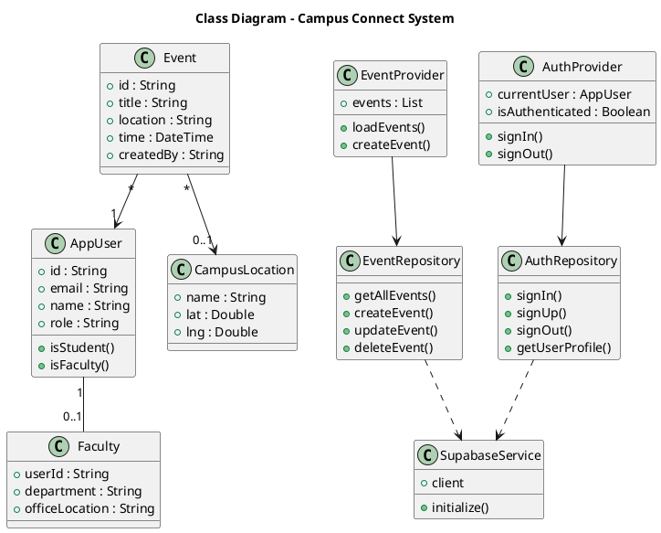
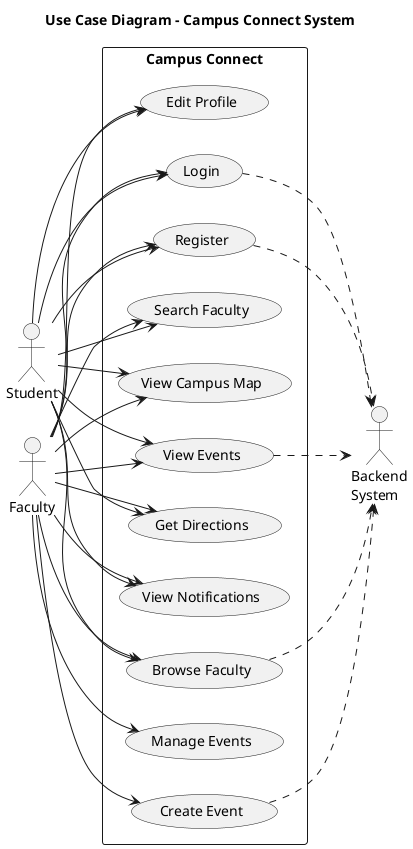
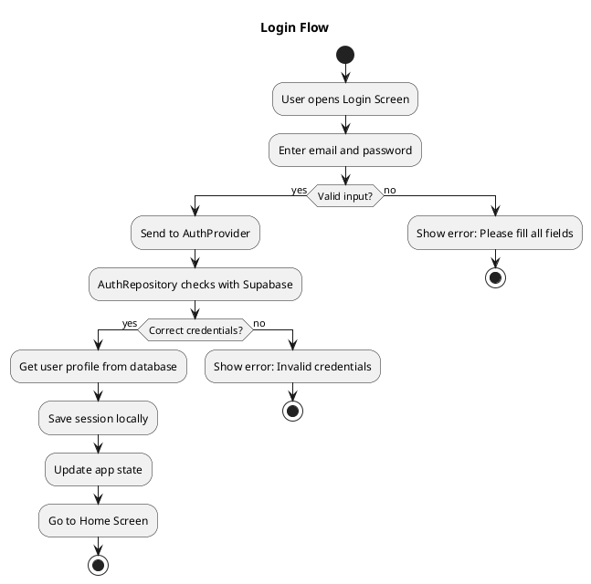
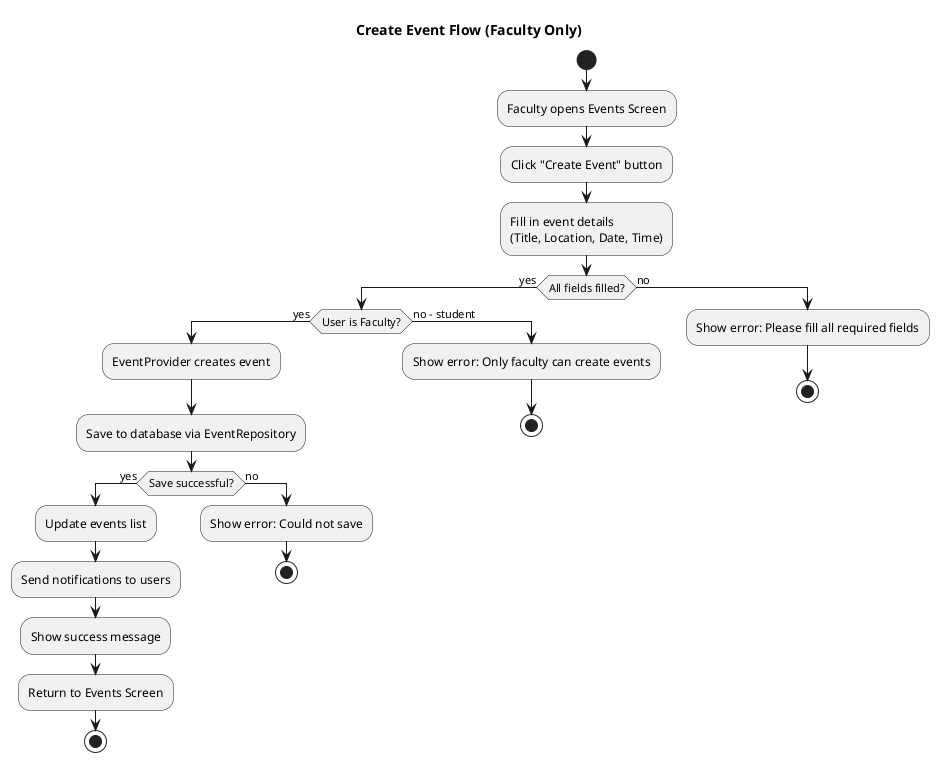

# Campus Connect - UML Diagrams (Simplified IEEE Standard)

Simple and clean UML diagrams following IEEE 1016-2009 and UML 2.5 standards.

---

## 1. Class Diagram

**Purpose:** Shows the main classes and how they relate to each other.

**Key Classes:**
- **Models** (`lib/core/models/`): AppUser, Event, Faculty, CampusLocation
- **Repositories** (`lib/features/*/data/`): Handle database operations
- **Providers** (`lib/core/providers/`): Manage app state
- **Services** (`lib/core/services/`): External integrations (Supabase)

**Relationships:**
- `-->` Uses/Depends on
- `--` Simple association
- `..>` Creates/Instantiates

---

## 2. Use Case Diagram

**Purpose:** Shows what users can do with the system.

**Main Features:**
- **Authentication**: Login, Register, Edit Profile
- **Events**: View, Create (Faculty only), Manage (Faculty only)
- **Faculty Directory**: Browse and Search faculty members
- **Campus Map**: View map and get directions
- **Notifications**: View event notifications

---

## 3. Activity Diagram - Login Flow

**Purpose:** Shows the steps when a user logs in.

**Simple Steps:**
1. User opens login screen and enters email/password
2. App validates the input
3. Sends credentials to backend (Supabase)
4. If correct: Get user info, save session, go to home
5. If wrong: Show error message

---

## 4. Activity Diagram - Create Event Flow

**Purpose:** Shows how faculty members create events.

**Simple Steps:**
1. Faculty opens Events Screen and clicks "Create Event"
2. Fills in event details (title, location, date, time)
3. App checks if user is faculty
4. Saves event to database
5. Sends notifications to all users
6. Shows success message and updates list

---

## Quick Reference

### Class Diagram
Shows the main building blocks:
- **Models**: Data structures (User, Event, Faculty)
- **Repositories**: Database operations
- **Providers**: State management
- **Services**: External services (Supabase)

### Use Case Diagram
Shows what users can do:
- **Student**: Can view events, browse faculty, use campus map
- **Faculty**: Can do everything student can + create/manage events

### Activity Diagrams
Shows step-by-step flows:
- **Login**: How users sign into the app
- **Create Event**: How faculty members create events

---

## How to View These Diagrams

**Online (Easiest):**
1. Go to: http://www.plantuml.com/plantuml/uml/
2. Copy any diagram code (from `@startuml` to `@enduml`)
3. Paste and view instantly!

**VS Code:**
1. Install "PlantUML" extension
2. Open this file
3. Preview diagrams directly

---

## Symbol Guide

**Class Diagrams:**
- `-->` One class uses another
- `--` Simple connection
- `..>` Creates or depends on
- `*` means many (e.g., `*` events)

**Use Case Diagrams:**
- Ovals = Things users can do
- Stick figures = Users (Student, Faculty)
- `..>` = Connects to backend

**Activity Diagrams:**
- Rectangles = Actions/Steps
- Diamonds = Yes/No decisions
- Start = Filled circle
- End = Circle with border

---

## IEEE Standard Compliance

✅ Follows IEEE 1016-2009 (Software Design)
✅ Follows UML 2.5 Standard
✅ Simple, clear, and professional
✅ All elements map to actual code files

