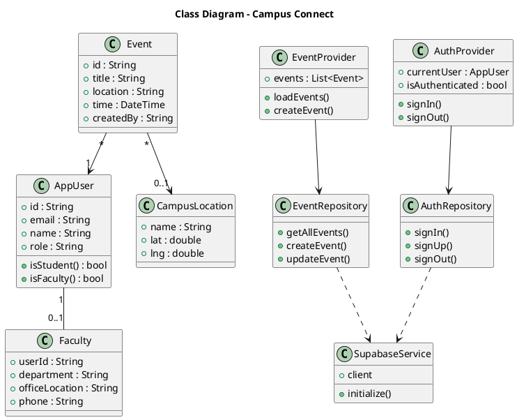
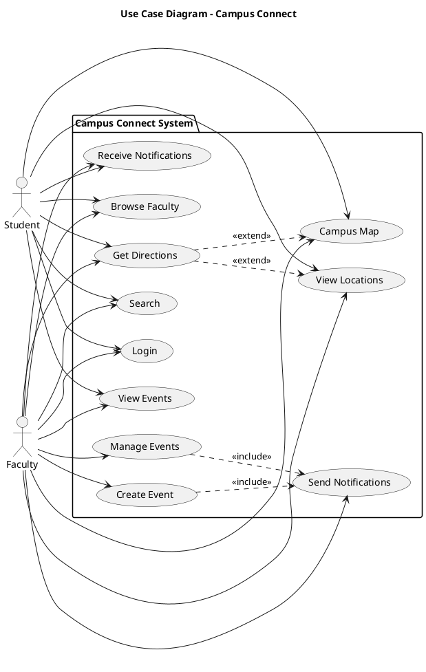
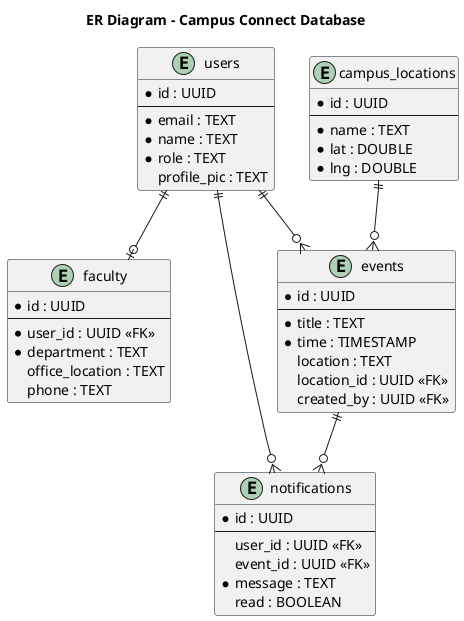
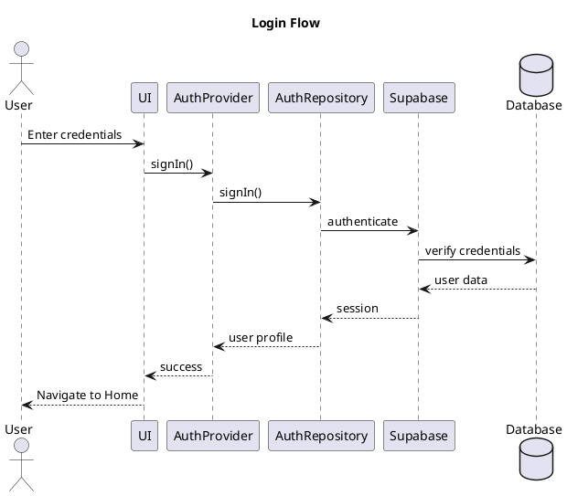
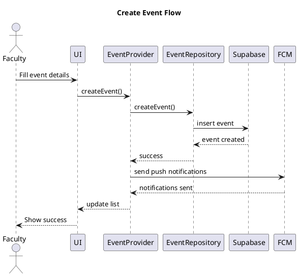
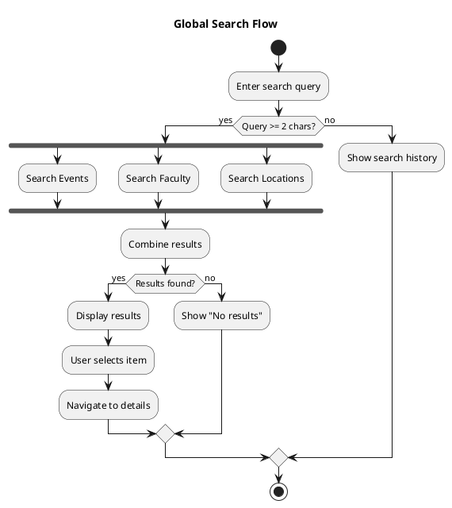
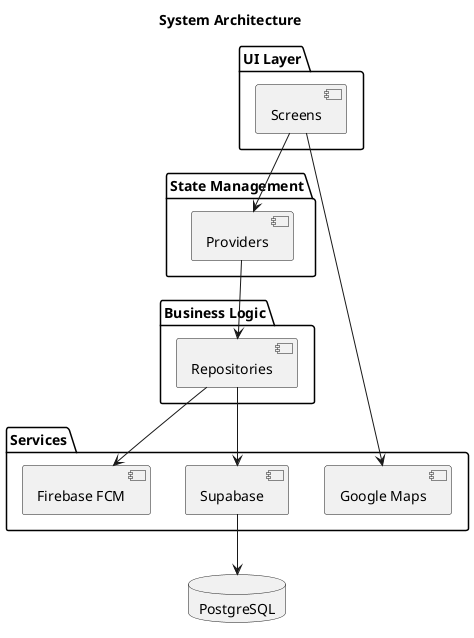

# Campus Connect - UML Diagrams

Simple and clean UML diagrams for the Campus Connect mobile application.

---

## 1. Class Diagram

**Purpose:** Core classes and their relationships.

---

## 2. Use Case Diagram

**Purpose:** What users can do in the system.

**User Roles:**
- **Student**: Login, View Events, Browse Faculty, Campus Map, Search, Receive Notifications, View Locations, Get Directions
- **Faculty**: All student features + Create Event, Manage Events, Send Notifications

**Key Interactions:**
- **Get Directions**: Users can click on any location (from map, events, faculty offices) to get turn-by-turn directions
- **Send Notifications**: Automatically triggered when faculty creates or manages events

---

## 3. ER Diagram

**Purpose:** Database structure and relationships.

**Tables:**
- **users**: All user accounts
- **faculty**: Faculty profile details
- **events**: Campus events
- **campus_locations**: Buildings with GPS coordinates
- **notifications**: Push notifications

---

## 4. Sequence Diagram - Login Flow

**Purpose:** User authentication process.

---

## 5. Sequence Diagram - Create Event Flow

**Purpose:** Faculty creates a new event.

---

## 6. Activity Diagram - Search Flow

**Purpose:** Global search workflow.

---

## 7. Component Diagram - Architecture

**Purpose:** System architecture overview.

**Layers:**
- **UI Layer**: Flutter screens and widgets
- **State Management**: Provider pattern
- **Business Logic**: Repositories for data operations
- **Services**: External integrations (Supabase, Firebase, Google Maps)

---

## Quick Reference

### Key Diagrams

1. **Class Diagram**: Core classes (Models, Repositories, Providers, Services)
2. **Use Case Diagram**: Student and Faculty capabilities
3. **ER Diagram**: Database structure (5 main tables)
4. **Sequence - Login**: Authentication flow
5. **Sequence - Create Event**: Event creation with notifications
6. **Activity - Search**: Global search workflow
7. **Component Diagram**: Layered architecture

### Technology Stack

- **Frontend**: Flutter 3.19+ with Provider
- **Backend**: Supabase (PostgreSQL)
- **Push Notifications**: Firebase Cloud Messaging
- **Maps**: Google Maps API
- **Security**: Row Level Security (RLS)

---

## How to View Diagrams

**Online (Easiest):**
1. Visit: http://www.plantuml.com/plantuml/uml/
2. Copy diagram code (from `@startuml` to `@enduml`)
3. Paste and view

**VS Code:**
1. Install "PlantUML" extension
2. Open this file
3. Press `Alt + D` to preview

---

## Diagram Symbols

- `-->` Uses/Depends on
- `--` Association
- `..>` Creates/Dependency
- `*` Many (e.g., one-to-many)
- `<<FK>>` Foreign Key
- `||--o{` One-to-many relationship

---

## Architecture Patterns

**Clean Architecture**: UI → Providers → Repositories → Services
**Repository Pattern**: Centralized data access
**Provider Pattern**: Reactive state management
**Singleton**: Services (Supabase, Storage)

---

**Last Updated**: 2025-11-30  
**Version**: 2.0  
**Campus Connect Development Team**

